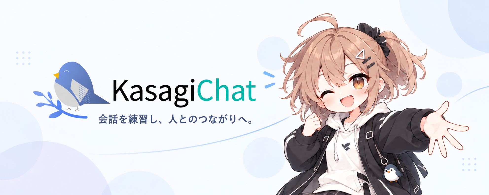

# KasagiChat



育てた自分の分身（NPC）が、イベントで人と人の出会いのきっかけを作る──コミュニケーションの練習と、リアルの出会い支援をひとつの世界でつなぐコミュニケーション・メタバースです。

[主要機能](#主要機能) · [画面構成](#画面構成) · [技術構成](#技術構成) · [ローカル開発](#ローカル開発) · [ドキュメント](#ドキュメント)

## コンセプト

カササギは、織姫と彦星のために天の川へ橋を架けたと伝えられる鳥です。KasagiChat はこの「人と人の間に橋を架ける」役割を AI に持たせます。AI は人間の代わりに会話する存在ではなく、**人と人をつなぐ存在**として機能します。

**NPC誕生 → 街で会話練習 → 分身の成長 → イベント参加 → 会話カード → 人に話しかける**

既存のメタバースは「人が集まって話す」で終わりますが、KasagiChat は**会話の前に「つながる理由」を用意します**。練習して分身を育てるほどイベントでのマッチングが濃くなり、育成の努力がリアルの出会いという報酬に変換されます。

## 主要機能

### 🐣 NPC誕生 — フォームではなく会話で始まる性格診断

生まれたばかりの分身との初会話がそのままオンボーディング。「趣味は何？」と聞かれて答えるうちに、性格・趣味・話し方・価値観の初期人格が形成されます。

### 💬 会話練習 — 場所を訪れる = シーンを選ぶ

マップ上の場所がそのまま練習シーンに。カフェで雑談、ロビーで初対面、オフィスで面接。分身は練習に同行し、終わったら褒めてくれます。

### 🌱 NPC育成 — 会話するほど「あなたらしく」なる

会話終了ごとに分身が性格・話題・話し方を学習。覚えた話題は**思い出の品**になって家に増え、レベルアップで服装・アクセサリーが解禁。世界に一人だけのNPCが育ちます。

### 🎪 イベント機能 — サービス最大の特徴

招待コード（URL / QR）で誰でもイベントを開催・参加。参加者のプロファイル同士でマッチングし、共通点の多い相手のカードがカササギの手紙で届きます。カードを開くと、自分の分身が「相手の分身と話してきた内容」とおすすめ話題を報告——**リアルで自然に話しかけるきっかけ**になります。

### 🕊 「評価しない」設計

コミュ力の採点はしません。成長はすべて**分身の変化**として表現し、フィードバックは褒める方向に限定。評価の矛先をNPCに外部化することで、怖くない練習体験にしています。

## 画面構成

舞台は、天の川をモチーフにした星川が流れる小さな街**「星川の街」**。ピクセル調の背景とイラストのNPCを組み合わせ、分身であるNPCを主役として際立たせます。橋を渡る = フォーマルなシーンへ行く、という世界の文法で、くらしエリアとしごとエリアを川が分けます。

```
        [オフィス]   [ロビー]        … しごとエリア（対岸）
   ～～～～～ 星川 ＋ 橋 ～～～～～
   [カフェ]  [広場(ハブ)]  [自分の家]  … くらしエリア（手前）
```

| 画面 | 役割 |
|---|---|
| タイトル / ログイン | OAuth ログイン（GitHub / Google） |
| NPC誕生 | 初会話によるオンボーディング |
| マップ（星川の街） | 5スポットを選べる画面（Three.js） |
| 会話画面 | 練習・今日のひとこと共通のチャットUI（マップ上オーバーレイ） |
| 家 | 思い出の品・プロフィール帳・図鑑・未読演出の読み返し |
| イベント作成 / 会場 | 開催・招待コード発行・参加NPCの賑わい表示 |
| カード開封 | 分身からの会話報告（スマホ対応） |
| 招待コード参加ページ | URL / QR からの入口（スマホ対応） |
| 設定 / 利用規約同意 | APIキー管理・初回同意フロー |

基本はPCブラウザ専用。ただしイベント現場でQRから入る導線（参加ページ・カード開封）のみスマホ対応しています。

## 技術構成

| レイヤ | 技術 |
|---|---|
| フロントエンド | Next.js（TypeScript）+ React Three Fiber / Three.js（マップ描画） |
| バックエンド | Spring Boot（Java） |
| DB | PostgreSQL（Supabase） |
| AI連携 | OpenAI / Anthropic API（BYOK）、Amazon Bedrock（本番デモ）、OpenAI互換エンドポイント（運営設定） |
| インフラ | AWS（Amplify Hosting + ECS Express Mode（Fargate 1タスク））+ GitHub Actions |

```
ブラウザ ─HTTPS─▶ Amplify Hosting（Next.js SSR: Three.jsマップ + チャットUI）
                  │ /api, /oauth2, /login/oauth2 を rewrites で HTTPS 転送
                  ▼
              ECS Express Mode の ALB ─▶ Fargate（Spring Boot）
                                           ├── PostgreSQL（Supabase）
                                           └── Bedrock（DEMO）/ OpenAI・Anthropic（BYOK）
```

- **ロジックはSpring Bootに一元化**: Next.jsにAPI Routes / BFF層は作らず「画面を描く係」に徹する。APIキー・会話状態・認証の真実をサーバ1箇所に保つ
- **認証**: Spring Security OAuth2 Client + セッションCookie。フロントとAPIを同一オリジン配下に置き、CORS・Cookie属性の問題を構成レベルで排除
- **デプロイ**: GitHub push → Amplify（フロント自動ビルド）/ GitHub Actions → ECS Express Mode（バックエンドのコンテナ）の2系統CI/CD。Amplify から ECS の ALB へは HTTPS で接続。構築手順は [docs/deploy-aws.md](docs/deploy-aws.md)

## ローカル開発

Node.js 22 と pnpm 11 を用意し、このリポジトリで以下を実行します。API が必要な画面では、別リポジトリ `KasagiChat-Background` の Spring Boot と PostgreSQL も起動してください。

```bash
corepack enable
pnpm install --frozen-lockfile
pnpm dev
```

フロントエンドは `http://localhost:3000`、バックエンドは通常 `http://localhost:8080` です。`next.config.ts` は `/api/*`、`/oauth2/*`、`/login/oauth2/*` を `API_PROXY_ORIGIN`（未設定時は `http://localhost:8080`）へ転送します。コンテナ内で Next.js を起動する場合は、コンテナから到達できるバックエンドのアドレスを設定します。OAuth のコールバックURLはブラウザから見える公開URLに合わせ、バックエンドの `APP_SECURITY_PUBLIC_URL` と各プロバイダの登録値を揃えてください。

フロントエンドのテストは `pnpm test`、静的確認は `pnpm lint` と `pnpm typecheck` です。`typecheck` 前に Next.js の生成型が古い場合は `pnpm exec next typegen` を実行します。バックエンドの環境変数・起動・テストの手順はバックエンドの README を参照してください。APIキーや暗号化鍵の実値をリポジトリへ保存しないでください。

## 設計上のこだわり

### 💸 BYOK前提のコスト設計

BYOK 利用時はユーザー自身の API キーで動くため、LLM 呼び出し1回がユーザーのお金に直結します。デモ利用時は運営が Bedrock の費用を負担します。このコストを踏まえて設計しています。

- **振り返り呼び出しの集約**: 会話終了時の1回のLLM呼び出しに、プロファイル更新・話題抽出・センシティブ判定・褒めフィードバック・成長演出・翌日の質問生成の6役を集約
- **遅延生成**: イベントのカード内容は本人が開いたときに生成。BYOK利用時は本人のキー、DEMO利用時は運営の設定で呼び出し、全組み合わせの事前生成をしない
- **無料で回る日次フック**: 「今日のひとこと」の質問は前日の振り返り出力を再利用（追加コストゼロ）。会場の賑わい演出もLLM不使用
- **明示発火の大原則**: ユーザーのキーによるLLM呼び出しは、必ず目に見えるユーザー操作で発火。暗黙の自動実行はしない

### 🎯 LLMに任せない境界線

LLMは得意なこと（会話・要約・分類）にだけ使い、確定的であるべき処理は機械計算に寄せています。

- EXP・レベル・解禁判定は機械計算（LLMに数値を決めさせると値がブレる）
- 会話の終了制御はターン数のサーバ制御（LLM判定だと「終わらない/すぐ終わる」事故が起きる）
- イベントマッチングはタグ一致のルールベース。embeddingも不使用（決定的・説明可能・テスト容易）

### 🔒 セキュリティ・プライバシー

- APIキーはサーバ側で暗号化保存。暗号化鍵はDBと別管理、マスク表示のみ、いつでも削除可
- OpenAI互換エンドポイントのURL指定は運営側設定に限定（SSRF対策）
- 話題は公開/非公開フラグで管理し、LLMがセンシティブ判定（健康・恋愛等はデフォルト非公開）。他人に渡るのは公開話題のみ+生成プロンプトのガードで二重防御

### 🧱 安定性優先の技術判断

実動アプリ審査があるため、リッチさより「事故らない」構成を選んでいます。

- SSEストリーミング不採用 → 一括返却+クライアント側タイプライター演出で見た目は同等に
- WebSocket不採用 → 画面遷移時に取得し、滞在中の新着は再訪問・再読み込みで反映
- 生成待ちのローディングは「カササギが手紙を運ぶアニメ」に変換（待ち時間を世界観演出へ）

## 開発ステータス

一人で開発中です。デプロイ構成は要件として定義していますが、この文書だけで本番環境の稼働確認を意味しません。

- ✅ 企画（壁打ち完了 → [idea.md](idea.md)）
- ✅ 要件定義（機能スコープ / 画面設計 / データモデル / API設計 / 非機能要件まで確定 → [requirements.md](requirements.md)）
- 🚧 実装・検証（進行中）

機能はMoSCoWで管理し、Must（NPC誕生・練習3シーン・育成・イベント機能・デモ環境）→ Should（着せ替え・図鑑・コスト表示）の順に実装・検証しています。

## ドキュメント

| ファイル | 内容 |
|---|---|
| [idea.md](idea.md) | 企画書。コンセプト・世界観・NPC成長の仕組み・イベント機能・ゲームデザインの設計判断を理由付きで記録 |
| [requirements.md](requirements.md) | 要件定義。機能スコープ（MoSCoW）・画面遷移・機能要件詳細・データモデル・API設計方針・非機能要件 |
| [docs/deploy-aws.md](docs/deploy-aws.md) | AWS 環境の構築・運用手順 |
| [docs/immersive-maps.md](docs/immersive-maps.md) | マップ描画の構成・JSON形式・変更箇所 |
| [docs/home-placement.md](docs/home-placement.md) | 家の思い出の品の配置・編集仕様 |
| [docs/town-map-interactions.md](docs/town-map-interactions.md) | 街のホバー・選択・会話開始の操作仕様 |

## クレジット

使用素材のライセンス表記は素材確定後に記載します。
